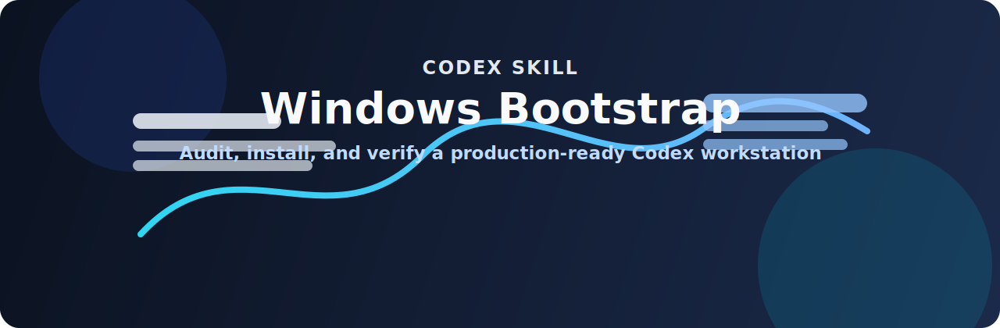

<p align="center">
  
</p>

<h1 align="center">Codex Windows Bootstrap Skill</h1>

<p align="center"><strong>Bootstrap, validate, and harden a Windows machine for Codex development in one pass.</strong></p>

<p align="center">
  
  
  
</p>

This skill bootstraps and verifies a Windows machine for Codex development workflows.

## What It Checks

- Core tools: `git`, `python`, `node`, `npm`, `gh`, `rg`, `uv`
- Python tooling support: `python -m virtualenv --version`, `python -m pylint --version` (installs missing Python packages in auto mode)
- Optional PDF tooling: Python imports for `reportlab`, `pypdf`, `pdfplumber`, `pdf2image`, `PIL`, plus `pdftoppm`, `pdfinfo`, and `qpdf`
- Git identity: `git config --global user.name/user.email`
- GitHub auth: `gh auth status` (active account)

## What V2 Adds

The script supports one-shot setup mode:

- `-AutoInstall` installs missing core tools with `winget`
- `-AutoInstall` installs missing `virtualenv` module with `python -m pip install --user virtualenv`
- `-AutoInstall` installs missing `pylint` module with `python -m pip install --user pylint`
- `-AutoInstall` adds the Python user Scripts directory to user `PATH` using a `%USERPROFILE%`-based path entry
- `-PromptOptionalTools` asks whether to install optional tools (`jq`, `fd`, `bat`, `Git LFS`, `Docker Desktop`)
- `-InstallOptionalTools` installs optional tools without prompting
- `-PromptPdfTools` asks whether to install PDF tooling (`reportlab`, `pypdf`, `pdfplumber`, `pdf2image`, `Pillow`, Poppler, QPDF)
- `-InstallPdfTools` installs PDF tooling without prompting
- then re-runs checks and reports `Ready` or `Not Ready`

## Install Skill On A New Machine

1. Copy this folder to:
   `%USERPROFILE%\.codex\skills\codex-windows-bootstrap`
2. Restart Codex (or start a new session).
3. Trigger with:
   `Use $codex-windows-bootstrap to bootstrap this machine.`

## Script Usage

Audit only:

```powershell
powershell -ExecutionPolicy Bypass -File .\scripts\bootstrap-codex-windows.ps1
```

Auto-install missing tools:

```powershell
powershell -ExecutionPolicy Bypass -File .\scripts\bootstrap-codex-windows.ps1 -AutoInstall
```

Auto-install and ask whether optional tools should be installed:

```powershell
powershell -ExecutionPolicy Bypass -File .\scripts\bootstrap-codex-windows.ps1 -AutoInstall -PromptOptionalTools
```

Auto-install including optional tools without prompting:

```powershell
powershell -ExecutionPolicy Bypass -File .\scripts\bootstrap-codex-windows.ps1 -AutoInstall -InstallOptionalTools
```

Auto-install and ask whether PDF tools should be installed:

```powershell
powershell -ExecutionPolicy Bypass -File .\scripts\bootstrap-codex-windows.ps1 -AutoInstall -PromptPdfTools
```

Auto-install including PDF tools without prompting:

```powershell
powershell -ExecutionPolicy Bypass -File .\scripts\bootstrap-codex-windows.ps1 -AutoInstall -InstallPdfTools
```

Set Git identity:

```powershell
powershell -ExecutionPolicy Bypass -File .\scripts\bootstrap-codex-windows.ps1 -ConfigureGit -GitUserName "your-name" -GitUserEmail "you@example.com"
```

Combined:

```powershell
powershell -ExecutionPolicy Bypass -File .\scripts\bootstrap-codex-windows.ps1 -AutoInstall -ConfigureGit -GitUserName "your-name" -GitUserEmail "you@example.com"
```

## Output

The script outputs JSON with:

- `Status` (`Ready` / `Not Ready`)
- `Actions` (install/config actions attempted)
- `Installed`
- `Missing`
- `PdfMissing`
- `Misconfigured`
- `AllChecks`
